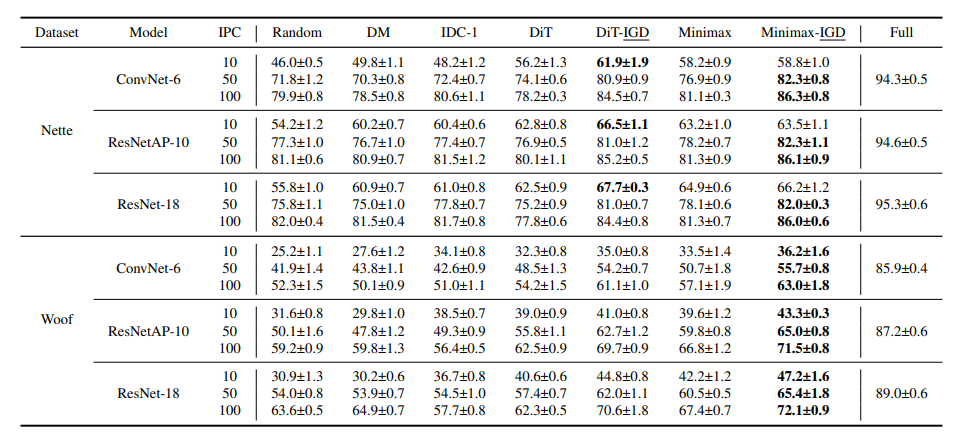

# ImageNette
baseline:

full set:

| 模型      | resnet10 | resnet18 | convnet6 |
|---------|----------|----------|----------|
| baseline | 94.6     | 95.3     | 94.3     |
| 结果      | 83.2     | 83.2     | 82       |

**用他的代码训练的代理模型是完全不如论文里报告的full set的准确率的**

Dit-IPC10：

| train\proxy | resnet10  | resnet18  | convnet6 |
|-------------|-----------|-----------|----------|
| resnet10    | 60.3+-0.3 |           |          |
| resnet18    |           | 59.9+-0.4 |          |
| convnet6    |           |           |          |

MiniMax-IPC10:

| train\proxy | resnet10  | resnet18  | convnet6 |
|-------------|-----------|-----------|----------|
| resnet10    | 60.3+-0.3 |           |          |
| resnet18    |           | 59.9+-0.4 |          |
| convnet6    |           |           |          |

# cifar
baseline:

MiniMax-IPC10: 

| 模型       | resnet10 | resnet18 |
|----------|-----------|----------|
| resnet10 |           | 81.3%    |
| resnet18 |           | 82.5%    |

