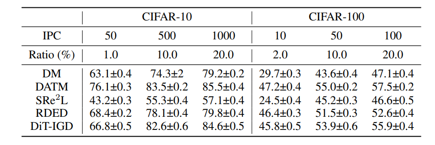

# ImageWoof
RAEIGD-IPC10:

| train\proxy  | resnet10 | resnet18 | convnet6 | dinov2-base |
|--------------|----------|----------|----------|-------------|
| resnet10     |          | 37.28    | 32.52    |             |
| resnet18     |          |          |          |             |
| convnet6     |          |          |          |             |
| dinov2-base  |          |          |          |             |

RAEIGD-IPC50:

| train\proxy  | resnet10 | resnet18 | convnet6 | dinov2-base |
|--------------|----------|----------|----------|-------------|
| resnet10     |          | 37.28    | 32.52    |             |
| resnet18     |          |          |          |             |
| convnet6     |          |          |          |             |
| dinov2-base  |          |          |          |             |

# cifar
baseline:

MiniMax-IPC10: 

| 模型       | resnet10 | resnet18 |
|----------|----------|----------|
| resnet10 | 81.5%    | 81.3%    |
| resnet18 |          | 82.5%    |
